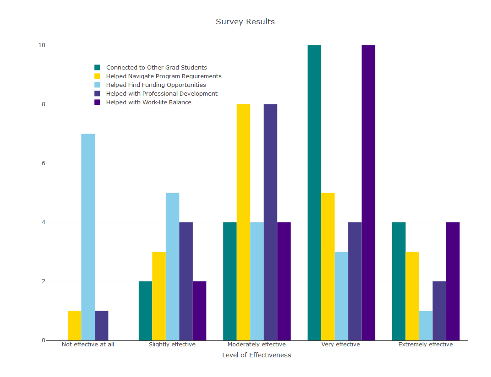

This document contains analysis of the 2019-2020 Soc Grad Mentorship Program Feedback Survey. The survey was distributed between June 15 and June 30, 2020. Thank you to everyone who participated this year! And thank you participants for providing us with such detailed feedback!

## Sample Information

There were 20 respondents to the survey out of 29 total participants in the program (69%). Some respondents were anonymous. From what we can tell at least one person from each group except one participated in the survey. 

## How well did the program meet its goals? 

The mentorship program has five goals: 

1. To foster a sense of community among graduate students to promote allyship and dialogue across cohorts.
2. To help newer graduate students learn about and navigate program requirements. 
3. To help graduate students find funding.
4. To help graduate students work on professional development.
5. To help graduate students balance personal life with program goals and requirements. 

```{r include=FALSE}
library("plotly")

knitr::opts_chunk$set(
  echo=FALSE,
  include=FALSE
)
        
# Load in data
mentor_data = read.csv("mentorship_analysis.csv", header = TRUE)

# Convert to factors
mentor_data$Q2 = factor(x = mentor_data$Q2, levels = c("Not effective at all", "Slightly effective", "Moderately effective", "Very effective", "Extremely effective"), labels = c("Not effective at all", "Slightly effective", "Moderately effective", "Very effective", "Extremely effective"))
mentor_data$Q3 = factor(x = mentor_data$Q3, levels = c("Not effective at all", "Slightly effective", "Moderately effective", "Very effective", "Extremely effective"), labels = c("Not effective at all", "Slightly effective", "Moderately effective", "Very effective", "Extremely effective"))
mentor_data$Q4 = factor(x = mentor_data$Q4, levels = c("Not effective at all", "Slightly effective", "Moderately effective", "Very effective", "Extremely effective"), labels = c("Not effective at all", "Slightly effective", "Moderately effective", "Very effective", "Extremely effective"))
mentor_data$Q7 = factor(x = mentor_data$Q7, levels = c("Not effective at all", "Slightly effective", "Moderately effective", "Very effective", "Extremely effective"), labels = c("Not effective at all", "Slightly effective", "Moderately effective", "Very effective", "Extremely effective"))
mentor_data$Q6 = factor(x = mentor_data$Q6, levels = c("Not effective at all", "Slightly effective", "Moderately effective", "Very effective", "Extremely effective"), labels = c("Not effective at all", "Slightly effective", "Moderately effective", "Very effective", "Extremely effective"))

```

```{r include=FALSE, fig.align="center"}
xform <- list(categoryorder = "array",
              categoryarray = c("Not effective at all", "Slightly effective", "Moderately effective", "Very effective", "Extremely effective"),
              title = "Level of Effectiveness")

allplot = plot_ly(mentor_data, type = "histogram")
allplot = add_trace(allplot, x = ~Q2, name = "Connected to Other Grad Students", marker = list(color = "teal"))
allplot = add_trace(allplot, x = ~Q3, name = "Helped Navigate Program Requirements", marker = list(color = "gold"))
allplot = add_trace(allplot, x = ~Q4, name = "Helped Find Funding Opportunities", marker = list(color = "skyblue"))
allplot = add_trace(allplot, x = ~Q7, name = "Helped with Professional Development", marker = list(color = "darkslateblue"))
allplot = add_trace(allplot, x = ~Q2, name = "Helped with Work-life Balance", marker = list(color = "indigo"))

allplot = layout(allplot, title = "Survey Results", xaxis = xform, legend = list(x = 0.1, y = 0.9))

export(allplot, "allplot.png")
```

{width=100%}

## Goal 1: Fostering Community Among Graduate Students

90% of survey respondents stated the program was moderately to extremely effective in facilitating connection to other graduate students. 70% of survey respondents stated the program was very or extremely effective in facilitating connection to other graduate students. 

## Goal 2: Navigating Program Requirements

80% of survey respondents stated the program was moderately to extremely effective in helping them navigate program requirements.

## Goal 3: Finding Funding Opportunities

60% of survey respondents stated the program was either not effective or only slightly effective with helping students find funding opportunities. 

## Goal 4: Supporting Professional Development

70% of survey respondents stated the program was moderately to extremely effective in supporting students with their professional development.

## Goal 5: Supported Work-Life Balance

90% of survey respondents stated the program was moderately to extremely effective in supporting students maintain work-life balance while in graduate school.

## How active were the groups? 

The program required groups to meet all three quarters of the academic year. This year the committee was particularly focused on groups meeting regularly. With the disruption caused by Covid-19 we encouraged people to meet virtually Spring quarter but did not require the third meeting.
 
* Three groups met all three quarters. 
* Four groups met for two quarters. 
* One group met for one quarter. 
* One group is unaccounted for. 

Considering the change in requirement due to Covid-19, 7 out of 9 groups (78% of the groups) or 23 out of 29 participants (79% of participants) met the program requirements. 

## Qualitative Feedback

We asked people if they thought the program goals should be updated, if the program requirements should be changed, if there was something the mentorship committee should do to help encourage groups to meet regularly, if there was any additional support the committee should provide, and what value came out of the mentorship program. About half of the respondents responded to these questions.

### Value of the Program

Overall the responses indicate people found the program valuable. The opportunity to connect with other graduate students, particularly across cohorts, was something that many people described as valued and appreciated. Additionally, people mentioned that they felt encouraged, comfortable asking their mentor(s) about things they did not feel comfortable asking an adviser, and enjoyed getting to hear about others' lives outside of the program. 

### Requests for Additional Structure

Most people thought the stated goals of the program were fine but many people requested the program provide greater structure to help groups discuss and tackle these goals. Several people suggested providing meeting agendas, a bank of resources, and meetings for the entire program to discuss topics related to the goals. Resources to discuss funding were particularly requested. A couple of people mentioned altering the mentorship intake survey to facilitate group matching based on the outcome individuals hope to achieve that year (e.g. navigating publishing, learning a specific method) in this way groups would be goal-oriented in addition to providing a space to socialize.
 
### Meetings

In terms of meetings, a few people mentioned scheduling difficulties in general and difficulties in scheduling related to Covid-19. Some requested additional meeting reminders by the committee, the use of social media or other platforms to facilitate communication among the group, continued meetings into the summer, and continued use of virtual meeting options into the future.  

## The Committee's Suggested Changes to the Program for the 2020-2021 Year

Based on suggestions from this survey and experience running the program for the past three years, the committee plans to implement the following changes to the program this academic year. 

### Standing Agendas

The committee will create a standing agenda of meeting topics that groups can use to facilitate conversation at their quarterly meetings, particularly conversations concerning program goals.

### Speed Mentoring Session

The committee will host a virtual speed mentoring session where grad students will have the opportunity to meet other grad students outside of their assigned group in a casual and informal way. Considering the need for physical distancing, informal interactions among graduate students that normally led to advice, encouragement, or support are now limited. Advanced graduate students have a wealth of knowledge that newer graduate students may benefit from but will have limited opportunity to learn about this year. This event is one way in which we can create community among graduate students while sheltering in place.

### Resource and Opportunity Sharing

The committee will work to facilitate sharing of opportunities in the department (for example: writing groups, fellowship opportunities) widely among all graduate students. Considering Covid newer graduate students may be unaware of many existing resources and opportunities that normally they would find out about informally in conversation with other graduate students in the hall and in office hours. 

### Funding

The committee will continue to try to find sources of funding for the program. 
