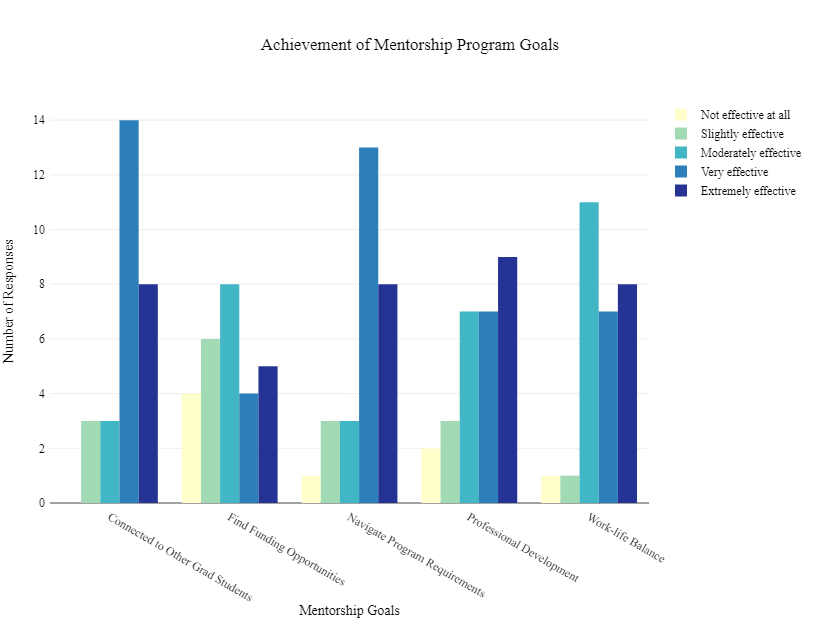

This document contains analysis of the 2020-2021 Sociology Graduate Student Mentorship Program Feedback Survey. Thank you to everyone who participated this year! The time and energy you give to one another is critical to the success of the program. And thank you participants for providing us with such detailed feedback!

# About the Mentorship Program:

The Graduate Student Mentorship Program (GSMP) began in 2017. The program was formed to build strong community and support among graduate students to ensure a diversity-aware department capable of meeting graduate student needs and promote allyship and dialogue across cohorts. The mentorship program pairs graduate students into small groups consisting of a mentor in the later stages in the program and two mentees in the middle and beginning stages of the program. Groups meet once per quarter and (pre-pandemic) were asked to attend fall and spring group events.

[**Check Out the Full Program Goals and Requirements Here.**]{.ul}

# Executive Summary:

The 2020-2021 program was highly successful despite operating during a global pandemic in which all mentorship meetings and events took place virtually.

-   We had record participation this year with 38 out of 67 graduate students participating for a total of 12 mentorship groups.

-   The program was highly effective in building cross-cohort connection and support among graduate students, helping students navigate program milestones, bolstering professional development, and supporting work-life balance.

-   We held four highly successful virtual mentorship events that brought graduate students together to discuss program milestones, research and funding hurdles, and provided much needed opportunities to socialize.

# Sample Information:

A feedback survey was distributed to participants in the mentorship program and was open for responses from June 18 to July 15, 2021. There were 28 respondents to the survey out of 38 total participants in the program (74%). Some respondents were anonymous. Last year's response rate was 69% or 20 responses out of 29 graduate students in the mentorship program.

We also contacted all graduate students who had never participated or who had not participated recently to inquire about any barriers to joining the program. We also contacted survey respondents who wanted to talk about the program in more detail. For confidentiality these responses are not included in the report. We also do not include direct quotes from the survey for the same reason.

# How Well Did the Program Meet its Goals?

The mentorship program has five goals:

1.  To foster a sense of community among graduate students to promote allyship and dialogue across cohorts.
2.  To help newer graduate students learn about and navigate program requirements.
3.  To help graduate students find funding.
4.  To help graduate students work on professional development.
5.  To help graduate students balance personal life with program goals and requirements.

```{r include=FALSE}
library("plotly")

knitr::opts_chunk$set(
  echo=FALSE,
  include=FALSE
)
        
# Load in data
mentor_data = read.csv("mentorship_analysis.csv", header = TRUE)

# Delete previews and completely empty responses
mentor_data = mentor_data[-c(1, 2, 19), ]

# Convert to factors
mentor_data$Q2 = factor(x = mentor_data$Q2, levels = c("Not effective at all", "Slightly effective", "Moderately effective", "Very effective", "Extremely effective"), labels = c("Not effective at all", "Slightly effective", "Moderately effective", "Very effective", "Extremely effective"))
mentor_data$Q3 = factor(x = mentor_data$Q3, levels = c("Not effective at all", "Slightly effective", "Moderately effective", "Very effective", "Extremely effective"), labels = c("Not effective at all", "Slightly effective", "Moderately effective", "Very effective", "Extremely effective"))
mentor_data$Q4 = factor(x = mentor_data$Q4, levels = c("Not effective at all", "Slightly effective", "Moderately effective", "Very effective", "Extremely effective"), labels = c("Not effective at all", "Slightly effective", "Moderately effective", "Very effective", "Extremely effective"))
mentor_data$Q7 = factor(x = mentor_data$Q7, levels = c("Not effective at all", "Slightly effective", "Moderately effective", "Very effective", "Extremely effective"), labels = c("Not effective at all", "Slightly effective", "Moderately effective", "Very effective", "Extremely effective"))
mentor_data$Q6 = factor(x = mentor_data$Q6, levels = c("Not effective at all", "Slightly effective", "Moderately effective", "Very effective", "Extremely effective"), labels = c("Not effective at all", "Slightly effective", "Moderately effective", "Very effective", "Extremely effective"))
mentor_data$Q8 = factor(x = mentor_data$Q8, levels = c("We met all three quarters (Fall, Winter, and Spring)", "We met two out of three quarters", "We never met"), labels = c("We met all three quarters (Fall, Winter, and Spring)", "We met two out of three quarters", "We never met"))


```

```{r include=FALSE, fig.align="center"}
xform <- list(categoryorder = "array",
              categoryarray = c("Not effective at all", "Slightly effective", "Moderately effective", "Very effective", "Extremely effective"),
              title = "Level of Effectiveness")

allplot = plot_ly(mentor_data, type = "histogram")
allplot = add_trace(allplot, x = ~Q2, name = "Connected to Other Grad Students", marker = list(color = "teal"))
allplot = add_trace(allplot, x = ~Q3, name = "Navigate Program Requirements", marker = list(color = "gold"))
allplot = add_trace(allplot, x = ~Q4, name = "Find Funding Opportunities", marker = list(color = "skyblue"))
allplot = add_trace(allplot, x = ~Q7, name = "Professional Development", marker = list(color = "darkslateblue"))
allplot = add_trace(allplot, x = ~Q6, name = "Work-life Balance", marker = list(color = "indigo"))

allplot = layout(allplot, title = "Effectiveness Meeting Program Goals", xaxis = xform, legend = list(x = 0.1, y = 0.9))

orca(allplot, "allplot.png")

# Warning isn't a big deal: https://community.rstudio.com/t/ploty-bar-chart-issue-cant-display-both-discrete-and-non-discrete-data-on-same-axis/44844

# using orca - https://github.com/plotly/orca#installation

# Importing picture - https://stackoverflow.com/questions/25166624/insert-picture-table-in-r-markdown

```

```{r}

m <- list(
  l = 50,
  r = 50,
  b = 100,
  t = 100,
  pad = 4
) # sets margins of plot

jdata = tidyr::pivot_longer(data = mentor_data[, c("ResponseId", "Q2", "Q3", "Q4", "Q6", "Q7")], cols = c("Q2", "Q3", "Q4", "Q6", "Q7"))

jdata$name[jdata$name == "Q2"] = "Connected to Other Grad Students"
jdata$name[jdata$name == "Q3"] = "Navigate Program Requirements"
jdata$name[jdata$name == "Q4"] = "Find Funding Opportunities"
jdata$name[jdata$name == "Q6"] = "Work-life Balance"
jdata$name[jdata$name == "Q7"] = "Professional Development"

jtable = as.data.frame(table(jdata$name, jdata$value), stringsAsFactors = FALSE)

jtable$Var2 <- factor(jtable$Var2,
                   levels = c("Not effective at all", "Slightly effective", "Moderately effective", "Very effective", "Extremely effective")) # https://stackoverflow.com/questions/38839657/how-can-i-retain-desired-order-in-r-plotly-bar-chart-with-color-variable

jplot <- plot_ly(data = jtable) %>% add_bars(x = ~Var1, y = ~Freq, color = ~factor(Var2), colors = "YlGnBu") %>% layout(title = "Achievement of Mentorship Program Goals", xaxis = list(title = "Mentorship Goals"), yaxis = list(title = "Number of Responses"), autosize = F, width = 820, height = 630, margin = m, font =list(family = "sans serif", color = "black")) # set colors - https://rpubs.com/juanhklopper/color_in_Plotly_for_R

orca(jplot, "goals_plot.png")


```



```{r}

# Q2
q2 = table(mentor_data$Q2)
q2_perc = q2/nrow(mentor_data)
  
# Q3
q3 = table(mentor_data$Q3)
q3_perc = q3/nrow(mentor_data)
  
# Q4
q4 = table(mentor_data$Q4)
q4_perc = q4/nrow(mentor_data)

# Q7
q7 = table(mentor_data$Q7)
q7_perc = q7/nrow(mentor_data)

# Q6
q6 = table(mentor_data$Q6)
q6_perc = q6/nrow(mentor_data)


goals_data = rbind(q2_perc, q3_perc, q4_perc, q7_perc, q6_perc)

goals_data = (formatC(goals_data, digits = 2, format = "f"))
goals_data = as.data.frame(goals_data)

goals_data = data.frame(t(goals_data))
colnames(goals_data) =  c("Connected to Other Grad Students",
                           "Helped Navigate Program Requirements", 
                            "Helped Find Funding Opportunities", 
                           "Helped with Professional Development", 
                           "Helped with Work-life Balance")


goals_data

```

## Goal 1: Fostering Community Among Graduate Students

Overall, 90% of graduate students said the program was moderately to extremely effective in helping them feel connected to other graduate students. 79% of graduate students said the program was very or extremely effective. These results are similar to last year, with a slight increase in the very to extremely effective responses. This is a pretty solid achievement considering the isolation many experienced during the pandemic.

## Goal 2: Navigating Program Requirements

Overall, 86% said the program was moderately to extremely effective in helping them navigate program requirements. 75% of graduate students said the program was very or extremely effective. This is a small improvement from last year where 80% said the program was moderately to extremely effective.

## Goal 3: Finding Funding Opportunities

The feedback on whether the program was effective in helping graduate students find funding was mixed. About a third said the program was very or extremely effective, about a third said it was moderately effective, and about a third said it was slightly or not effective. These results are an improvement over last year where two-thirds said the program was slightly or not effective at all. We attribute this improvement to offering funding panels during the mentorship events and to individual groups' focus on this goal.

## Goal 4: Supporting Professional Development

82% of graduate students said the program was moderately to extremely effective in helping with professional development. These results are better than last year where 70% said the program was moderately to extremely effective.

## Goal 5: Supported Work-Life Balance

93% of graduate students said the program was moderately to extremely effective in helping support work-life balance. These results are similar to last years'.

## Should the Program Goals be Changed, Updated, or Altered?

Ten graduate students responded to this optional question. The majority recommended no change to the existing goals. We received a few suggestions that groups meet more frequently or provide more opportunities to meet other graduate students outside their group.

# Value of the Mentorship Program:

Graduate students unequivocally found meaning and value in the program as evidenced in the qualitative feedback we received.

**Graduate students highlighted that they:**

-   learned a lot from their mentors,

-   valued hearing from graduate students in different stages of the program,

-   felt they could be open, honest, and vulnerable with their group and attributed this to their individual success in the sociology program,

-   found the program helpful for staying connected to each other and the department particularly since the department did not offer many social events this year,

-   felt the program gave them an opportunity to interact with other graduate students they otherwise might not have met,

-   received social support and department program-related support from their group,

-   appreciated being able to connect with people who do similar research.

# Participation in the Mentorship Program:

Out of 67 graduate students in the sociology department in the 2020-2021 academic year, 38 graduate students (about 57%) participated in the program. This is highest level of participation since the program began in 2017.

| Program year | Total participants | Total groups |
|--------------|--------------------|--------------|
| 2017-2018    | 31                 | 8            |
| 2018-2019    | 24                 | 7            |
| 2019-2020    | 29                 | 9            |
| 2020-2021    | 38                 | 12           |

## Quarterly Group Meeting Attendance

The program required groups to meet all three quarters of the academic year. Groups were asked to meet virtually per campus guidelines. A majority of the groups (8 out of 12) met all three quarters. Most groups met once per quarter. Three groups went above and beyond and met two or more times a quarter.

| Quarterly Meetings            | Number of groups |
|:------------------------------|------------------|
| Met all three quarters        | 8                |
| Met two out of three quarters | 1                |
| Never met                     | 1                |
| Groups unaccounted for        | 2                |

## Challenges to Meeting Quarterly

Only a couple of respondents mentioned scheduling challenges as a reason preventing their groups from being able to meet per the program requirements. One person mentioned zoom fatigue as an issue as well. We received one recommendation that groups schedule their meetings at the beginning of the quarter or towards the end to more easily be able to find a time everyone can meet. We agree with this advice! We have also tried to keep groups small - about 3 to 4 members - to make scheduling easier.

## Mentoring Events Attendance

New this year we held four optional mentorship events to increase opportunities for interaction and support among graduate students since in-person informal interactions were limited by the pandemic. These events were advertised to all sociology graduate students and not just those who participated in the mentorship program.

The mentorship events were highly successful in building connection among graduate students and meeting other program goals and were well attended. These events were critical as the GSSA had no social chair this year and limited social events were planned by graduate students or the department more broadly.

**The Mentorship Events included:**

-   Fall Quarter - "Speed" mentoring on navigating program milestones (topics: QP, QE, faculty mentoring, surviving grad school, fellowships)
-   Winter Quarter - Finding your way in the fog: Navigating nebulous times in grad school (topics: finding funding, organizing unstructured time, developing a research question, staying well) included invited alumni.
-   Spring Quarter - R&D Conference - Publishing your work panel
-   Spring Quarter - R&D Conference - Finding funding panel

| Mentorship event               | Number of survey respondents who attended |
|:-------------------------------|-------------------------------------------|
| Did not attend                 | 7                                         |
| Fall Quarter Event             | 17                                        |
| Winter Quarter Event           | 15                                        |
| Spring Quarter Events          | 10                                        |
| Attended at least three events | 8                                         |

## Interest in Holding Mentoring Events Again in the Future

| Interest             | Number of respondents |
|:---------------------|-----------------------|
| Extremely interested | 16                    |
| Somewhat interested  | 10                    |
| Not interested       | 1                     |

## Feedback on Mentorship Events

Those that responded said they thought the events were helpful, informative, engaging, and fun. This reflects feedback we received personally after the events. A couple folks remarked that they had scheduling conflicts or felt that the spring events could have been better attended.

## Ideas for Future Mentorship Events

**Suggested ideas included:**

-   Community-building generally like picnics or painting.

-   Demystifying forming your QP or Dissertation Committee.

-   When to start looking for teaching opportunities or internships.

-   How to develop feasible research projects to meet department deadlines.

-   How to process criticism/feedback on writing or presentations.

-   How to stay motivated/inspired on long-term projects.

-   How to navigate project set backs (e.g., delays).

-   Organizing project workflows.

# Evaluation of Program Funding:

When we began the mentorship program in 2017 we did not have any funding. We pursued funding for the program from the department during the 2019-2020 academic year. We wanted to incentivize regular group meetings and provide some monetary compensation for the labor mentors and mentees devote to the program.

In 2019-2020 the chair awarded \$500 for the program. This support continued in 2020-2021. In the 2019-2020 academic year we used the funds to reimburse group meeting expenses including food and non-alcoholic beverages. Equally distributed by group size (24 participants, 7 groups in that year) meant each group received \$18 a quarter. Not all groups pursued reimbursement for their meeting expenses due to the hassle.

In the 2020-2021 academic year the staff assisted us in purchasing Amazon gift cards as campus guidelines restricted in-person meetings and did not allow for reimbursement of food or beverages consumed during virtual meetings. Equally distributed among all participants (38 participants) meant each person received a \$10 gift card.

We asked survey respondents if the funding provided seemed adequate. Particularly as the amount of money per person was less this year due to an increase in participation and because we wanted to gauge how participants would like to use these funds in the future. While per person the amount was less this year compared to last year, being able to provide gift cards rather than ask individuals to pursue reimbursement meant that we were able to use all the funds allocated to us.

| Is the amount of funding adequate? | Number of responses |
|:-----------------------------------|---------------------|
| No                                 | 6                   |
| Yes                                | 13                  |
| Not sure                           | 1                   |

## Ideas for future funding uses

The suggestions were roughly tied between doing gift cards again (x3), providing more funding so groups could have a meal together (x3), and using the funding for some sort of all groups event (x4).

# Additional Support Requested:

Overall folks said they were happy with the level of support provided and acknowledged the work the committee is already doing and did not want to add to it. A couple suggestions we did receive: continue providing quarterly reminder emails to schedule meetings, help groups focus and organize their goals via a group-development document at the beginning and have a check in mid-year, check with groups midyear to see if any shuffling of members might be helpful, and allow groups to stay together into the next year.

# Our Goals for the 2021-2022 Year:

Based on this feedback, our informal discussions with folks who did and did not participate, and our experience running this program for the past four years we propose the following goals for this coming year:

-   Continue to ask if group members would like to remain together for the following year in the in-take survey. We will try to honor these requests as best we can based on who signs up to participate.

-   Continue to organize mentorship events. As current we plan to do a fall social kick-off event (as required by the mentorship program guidelines but we were unable to organize last year due to the pandemic), a virtual winter quarter event with alumni, an event in collaboration with the Research and Development conference again during spring quarter focusing on the research process specifically, and an end-of-the-year potluck.

-   Pursue funding for both an in-person group event (ideally food at the fall kick-off) and provide individual/group funds.

-   Conduct a brief survey or temperature check (2 to 3 questions) during winter quarter to gauge group dynamics and normalize shifting group members as needed at that time.

-   Send out a campus resources document that highlights services for struggling students.

-   Present our work and success developing the mentorship program over these past four years at ASA.

-   Document how to run the program for future committee members.

-   Recruit additional member(s) to the committee to ensure long term success of the program.
